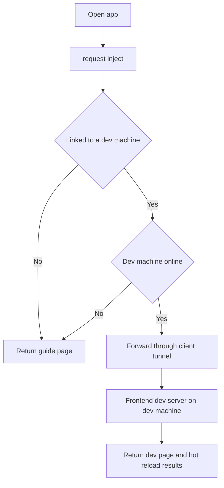
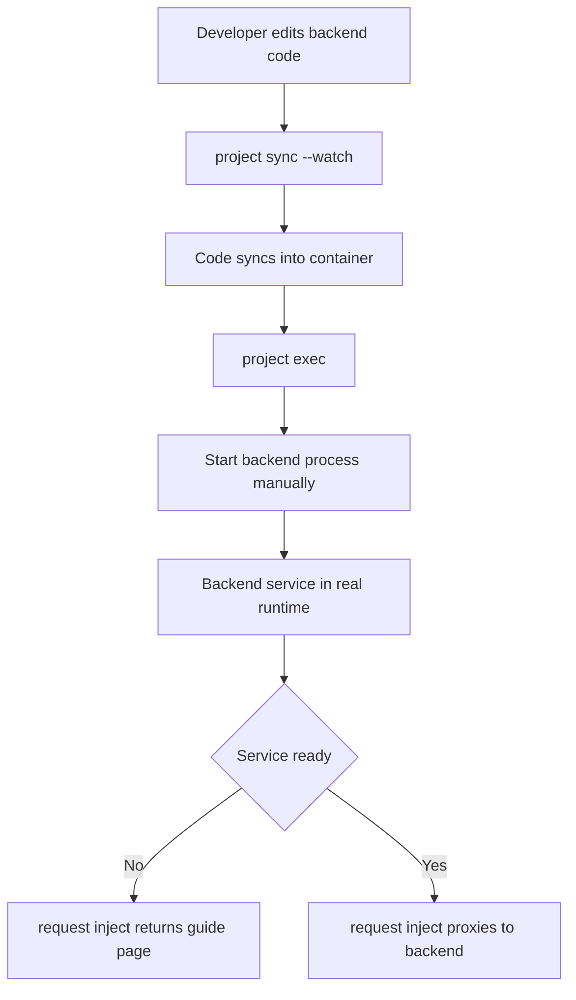

# LazyCat Development Workflow

This reference covers the development workflow for LazyCat applications, including frontend/backend development, build configuration, and release process.

## Core Decision Table

| Your Goal | Use This | Do Not Start With |
|-----------|----------|-------------------|
| Change UI with hot reload | `project deploy` + open app + `npm run dev` | Do not start from release packaging |
| Change backend code that depends on real `/lzcapp/*` | `project deploy` + `project sync --watch` + `project exec` | Do not prioritize full local simulation |
| Build a package for others to install | `project release` | Do not treat dev deployment as release |

## Build Configuration Layers

### 1. lzc-build.yml (Release Config)

The default build config and release config.

```yaml
manifest: ./lzc-manifest.yml
pkgout: ./
icon: ./icon.png

# Optional: embedded images
images:
  app-runtime:
    dockerfile: Dockerfile
    context: .
```

### 2. lzc-build.dev.yml (Dev Override)

An optional dev override file that only keeps diffs relative to release.

```yaml
pkg_id: org.example.todo.dev  # Dev package ID

envs:
  - DEV_MODE=1  # Enable dev-only features
```

**Key points:**
- `pkg_id` override prevents dev from overwriting release
- `DEV_MODE=1` enables dev-only `#@build` blocks
- Do not copy full config - keep only diffs

### Command Defaults

| Command | Config Used |
|---------|-------------|
| `project deploy` | `lzc-build.dev.yml` if exists, else `lzc-build.yml` |
| `project info/start/exec/cp/log/sync` | Same as deploy |
| `project release` | Always `lzc-build.yml` |

Use `--release` flag to explicitly use release config.

---

## Frontend Development Path

### Workflow



### Recommended Order

1. `lzc-cli project deploy`
2. `lzc-cli project info`
3. Open the app first
4. Then run `npm run dev`
5. Refresh the page and continue development

### Why Open App Before Dev Server

1. Confirm whether instance is linked to dev machine
2. See which port the inject script is waiting for
3. Get explicit guidance instead of blank page or generic error

---

## Backend Development Path

### Workflow



### Recommended Order

1. `lzc-cli project deploy`
2. `lzc-cli project info`
3. Open the app first
4. If page says backend not ready:
   - Start sync: `lzc-cli project sync --watch`
   - Enter container: `lzc-cli project exec /bin/sh`
   - Start backend manually: `/app/run.sh`
5. Refresh after backend is ready

### Why Backend Runs in Real Runtime

Backend code often depends on:
- Real `/lzcapp/run` or `/lzcapp/var` paths
- Runtime sockets, mounts, permissions
- Real container networking

---

## Manifest Build Preprocessing

Use `#@build` directives for dev/release conditional content.

### Available Directives

```yaml
#@build if profile=dev        # Dev profile only
#@build if env.DEV_MODE=1     # Environment variable check
#@build else                   # Else branch
#@build end                    # End conditional
#@build include ./path.yml    # Include file
```

### Example: Dev-Only Injects

```yaml
application:
  routes:
    - /=file:///lzcapp/pkg/content/dist
#@build if env.DEV_MODE=1
  injects:
    - id: frontend-dev-proxy
      on: request
      auth_required: false
      when:
        - "/*"
      do:
        - src: |
            // dev-only request inject here
#@build end
```

**Result:** Release package does not contain dev-only inject.

---

## Release Workflow

### Clean Release Package Requirements

1. Uses `lzc-build.yml`
2. No dev-only `pkg_id` override
3. No dev-only `#@build` branches
4. Image contains only final artifacts
5. Works without dev machine online

### Release Command

```bash
lzc-cli project release -o app.lpk
```

### Verification Checklist

- [ ] Package name does not contain `.dev` suffix
- [ ] Packaged manifest has no dev-only inject blocks
- [ ] Release image not built from `Dockerfile.dev`
- [ ] Package works without dev machine online

---

## File Structure

### Recommended Project Layout

```
myapp/
├── lzc-build.yml          # Release build config
├── lzc-build.dev.yml      # Dev override (optional)
├── lzc-manifest.yml       # App runtime config
├── package.yml            # Static package metadata
├── icon.png               # 512x512 PNG icon
├── src/                   # Source code
├── dist/                  # Build output (for contentdir)
└── Dockerfile             # For embedded images (optional)
```

### package.yml (Static Metadata)

```yaml
package: org.example.myapp
version: 1.0.0
name: My Application
description: A sample application
author: Developer Name
license: MIT
homepage: https://example.com
```

### lzc-manifest.yml (Runtime Config)

```yaml
application:
  subdomain: myapp
  upstreams:
    - location: /
      backend: http://web:8080/

services:
  web:
    image: myapp:latest
    environment:
      - SOME_CONFIG={{.U.some_config}}
    healthcheck:
      test: ["CMD-SHELL", "curl -f http://localhost:8080/health"]
      start_period: 30s
```

---

## Common Errors

### 1. Dev Changes Overwrite Release App

**Cause:** No `lzc-build.dev.yml` or no dev `pkg_id`

**Fix:**
1. Check `lzc-build.dev.yml` exists
2. Verify `pkg_id: org.example.todo.dev` in dev config
3. Check printed `Build config` line

### 2. Page Shows "Waiting for Development"

**Cause:**
- Frontend dev server not started
- Instance not synced to dev machine
- Dev machine offline

**Fix:**
1. Run `lzc-cli project deploy`
2. Start `npm run dev`
3. Compare port with guide page

### 3. Backend Synced But Not Working

**Cause:**
- Backend process not started
- Request inject target mismatch
- Service not ready yet

**Fix:**
1. Use `lzc-cli project exec /bin/sh` to verify
2. Check `lzc-cli project log -f`
3. Compare backend address with inject target